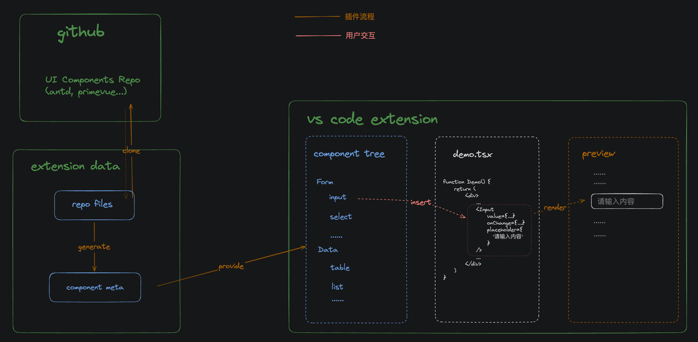
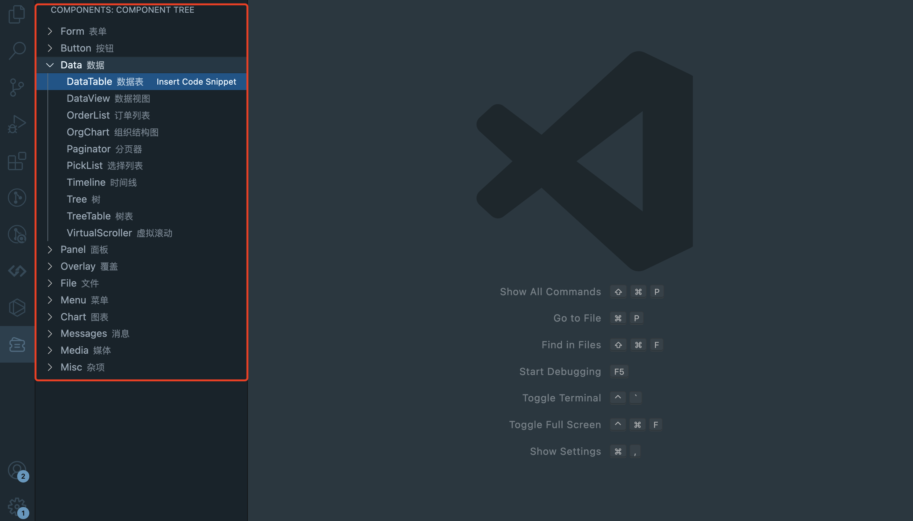
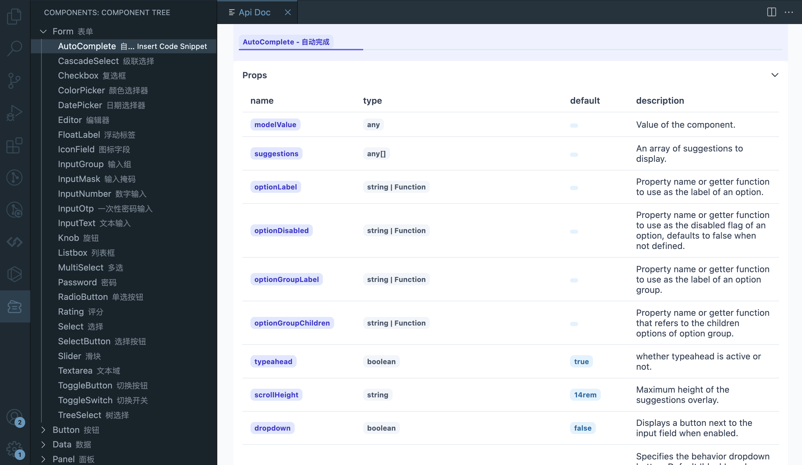
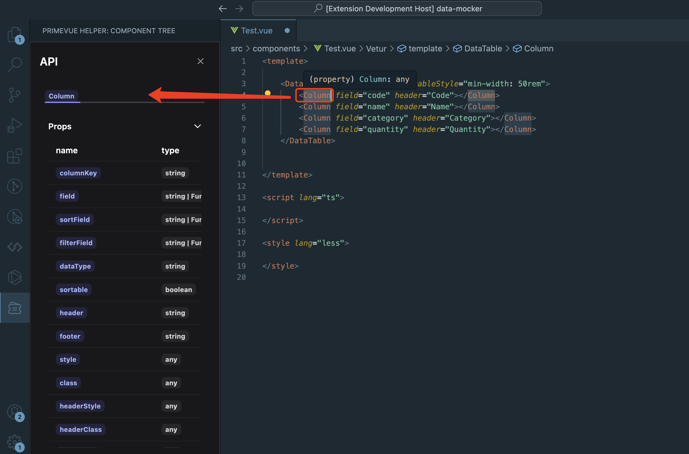
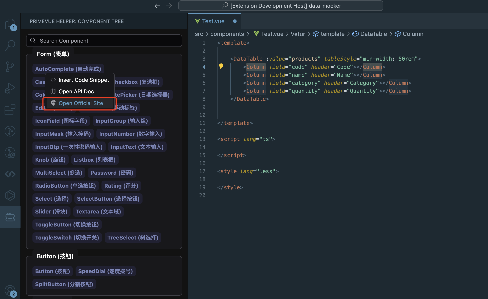
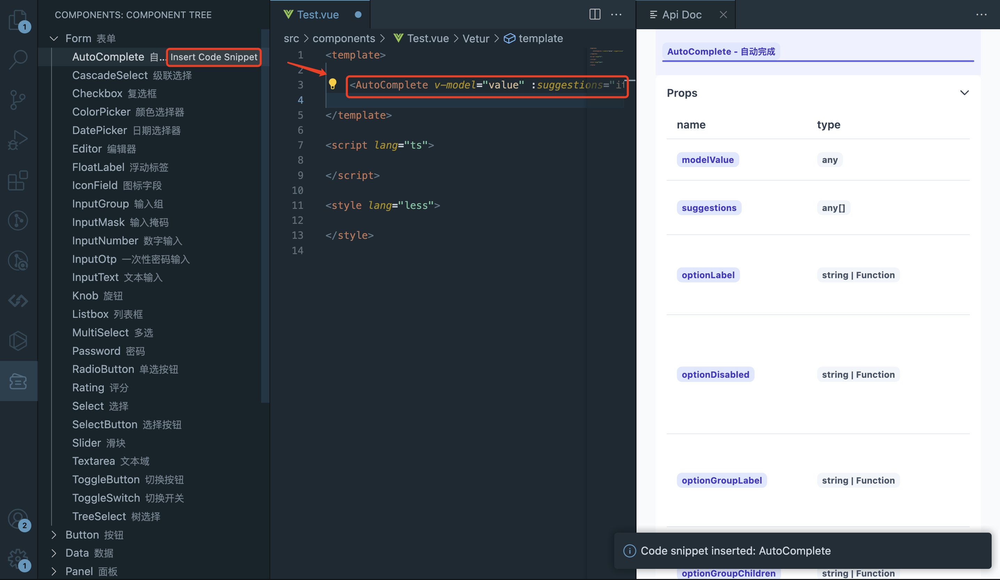
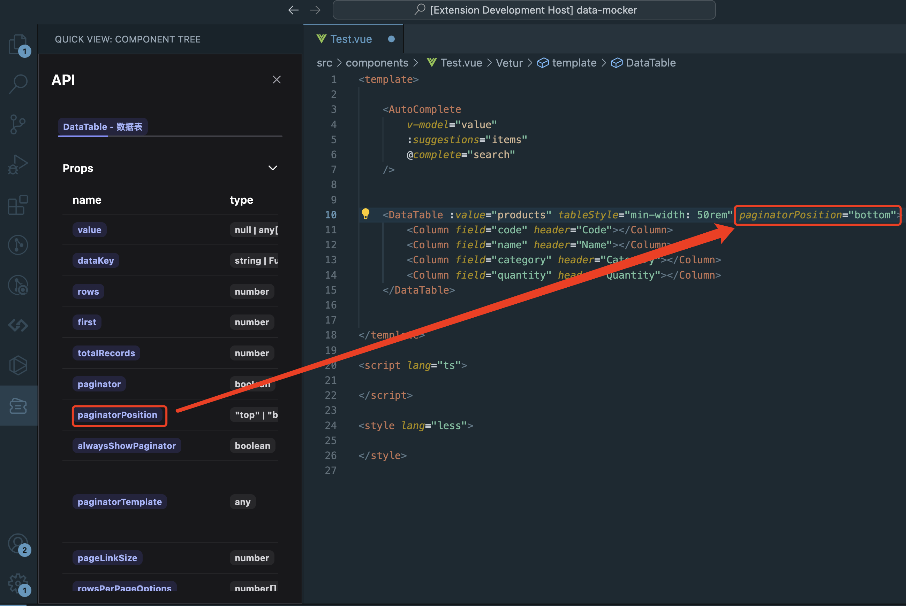

# Primevue Helper
Primevue Helper is a simple, lightweight, and easy-to-use `extension for Visual Studio Code` that improving your development efficiency.

## setup

1. Open Visual Studio Code
2. Click on the Extensions icon in the Activity Bar on the side of the window
3. Search for "Primevue Helper" and click Install

## Features

- [x] support view api document
- [x] support insert template snippet
- [x] support insert props & slots & emits snippet
- [x] support open official website

### Component Tree
Click on the `Primevue Helper` icon in the Activity Bar on the side of the window

you can see a tree of components.

### API Docs
Select the component you want to view. The API docs will be displayed in the panel

if you already using some components, you can double click on the `component tag` in the editor to open the API docs. that's very useful when you want to view some components not displayed in the tree. like `column` etc.

if you want to know more information about components, you can also click on the `open official website` option in contextmenu to open the official website of primevue.

### Insert Code Snippet
Click on the `Insert Code Snippet` icon in contextmenu you can insert the code snippet to your current file.

### Insert Props & Slots & Emits Snippet
Click on props name will insert the prop snippet to focus position in current file.

## Contributing

Contributions are welcome! Please feel free to submit a pull request or open an issue if you have any questions or suggestions.

## License

This project is licensed under the MIT License - see the LICENSE file for details.